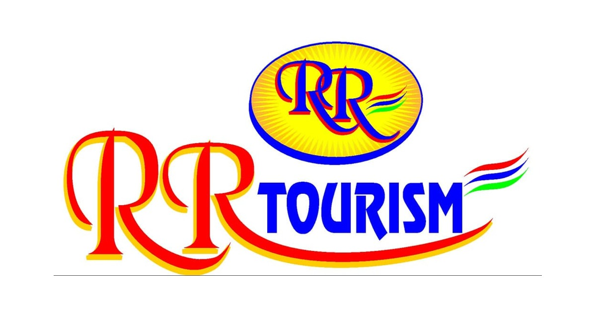
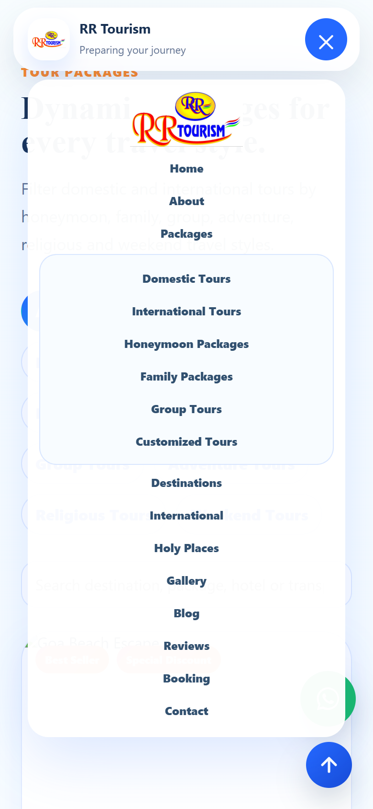

# RR Tourism Website



## Live Website

Visit the live website here:

[https://satitech-official.github.io/rr-tourism-website/](https://satitech-official.github.io/rr-tourism-website/)

## About

RR Tourism is a premium, colorful, responsive travel and tourism website for RR Tourism, based in Mhow, Indore, Madhya Pradesh.

The website helps visitors explore domestic and international tour packages, popular destinations, holy trips, honeymoon packages, customized trip planning, gallery photos, reviews, booking enquiries, and direct WhatsApp contact.

## Key Features

* Fully responsive design for mobile, tablet, laptop, and desktop
* Premium bright travel-inspired UI
* Hero section with autoplay travel background video
* Domestic and international tour package sections
* Holy places and international holy trips
* Dynamic package cards and filters
* Gallery with travel memories
* Customer reviews and FAQ sections
* Booking enquiry and customized trip planner forms
* Contact section with phone, WhatsApp, email, and map
* Floating WhatsApp button
* Smooth scrolling, animations, hover effects, and micro-interactions
* GitHub Pages deployment workflow

## Live Preview



## Contact

**RR Tourism**  
Mhow, Indore, Madhya Pradesh

**Phone**

* +91 90090 71697
* +91 83493 94939

**WhatsApp**

* +91 90090 71697

**Email**

* Info@rrtourism.com

## Project Structure

```text
rr-tourism-website/
|-- index.html
|-- styles.css
|-- app.js
|-- README.md
|-- .nojekyll
|-- .github/workflows/pages.yml
`-- assets/
    |-- hero-travel.mp4
    |-- rr-tourism-logo.png
    |-- rr-tourism-social-preview.jpg
    |-- favicon.png
    |-- gallery-pdf/
    `-- holy/
```

## Deployment

The website is deployed with GitHub Pages using the workflow in:

`.github/workflows/pages.yml`

Every push to the `main` branch triggers the deployment workflow.

## Developed By

Designed and developed by **Sati Technologies** for **RR Tourism**.

---

**Explore More. Travel Better. Create Memories with RR Tourism.**
